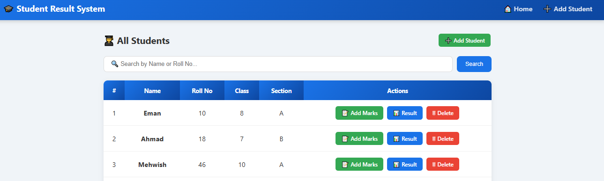
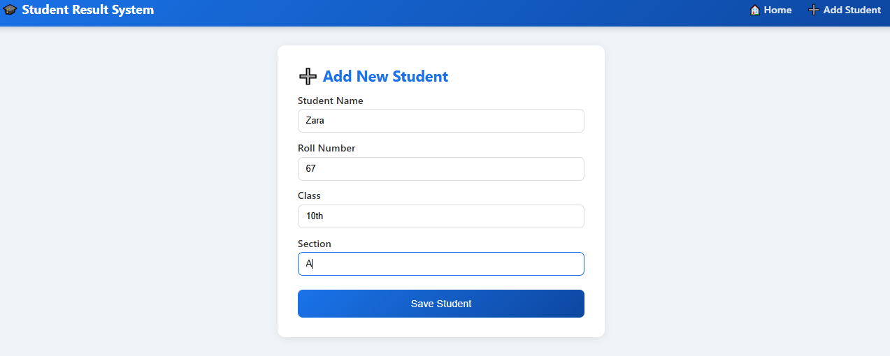
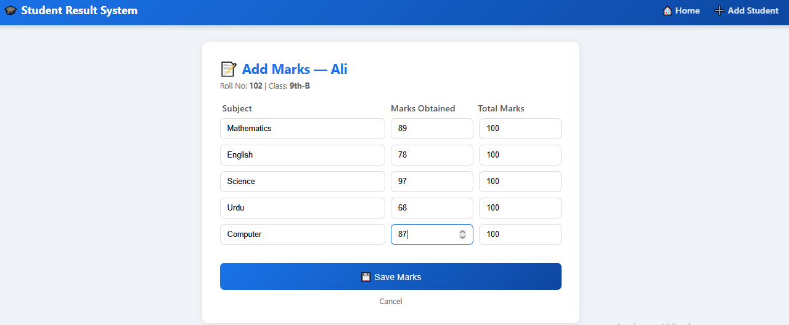
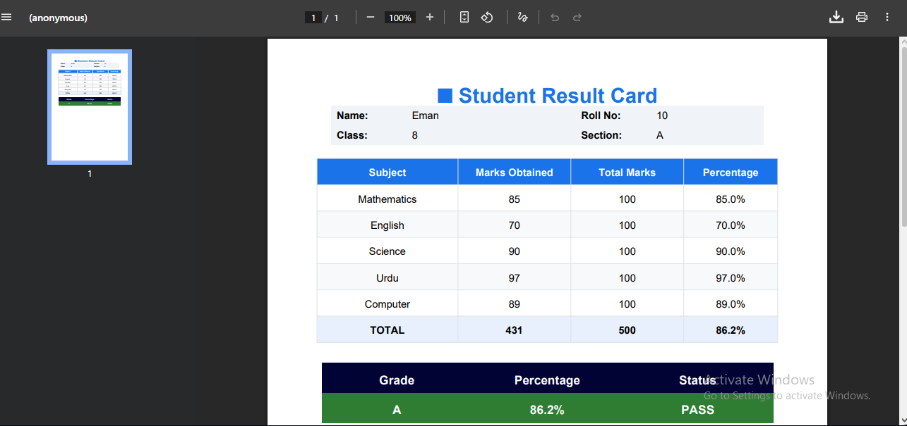
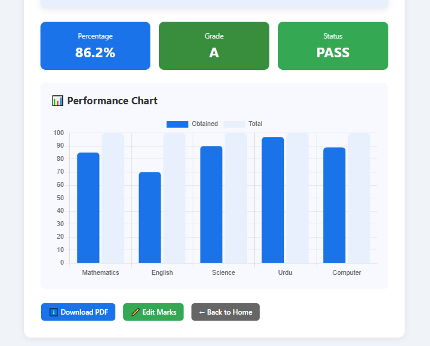

# Student Result Management System

A web-based Student Result Management System built with Python Flask and SQLite.

## Features
- Add and manage students
- Record subject marks
- Auto-calculate grades and percentage
- Generate result cards
- Download PDF reports
- Performance charts

## Tech Stack
- Python Flask
- SQLite Database
- HTML, CSS
- Jinja2 Templates

## How to Run
1. Clone the repository
2. Install dependencies: `pip install flask`
3. Run: `python app.py`
4. Open: `http://127.0.0.1:5000`

## Screenshots

| Students List | Add Student | Add Marks |
|---------------|-------------|-----------|
|  |  |  |

| Result Card | Performance Chart |
|-------------|-------------------|
|  |  |
